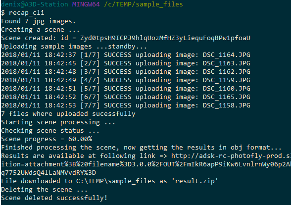

# recap_cli
[](https://travis-ci.org/apprentice3d/reality.capture-go-cli.sample)
[](https://goreportcard.com/report/github.com/apprentice3d/recap_cli)

[](http://opensource.org/licenses/MIT)

**Forge API:** [](http://developer-autodesk.github.io/)
[](http://developer-autodesk.github.io/)


`recap_cli` is a simple command-line app illustrating use of Forge Reality
Capture API to get an OBJ from collection of jpg images.


## Setup

Grab the latest binary from the [releases](https://github.com/apprentice3d/recap_cli/releases) page and place it into directory listed in ```$PATH```,
or if you have Go already setup, run

    go get -u github.com/apprentice3d/recap_cli

this will download the source, compile it and install into $GOBIN the
`recap_cli` executable.

Set the ```FORGE_CLIENT_ID``` and ```FORGE_CLIENT_SECRET``` environment
variables with your Forge secrets.

## Usage

To start use the app, use command-line to go to folder containing images
needed to be processed and just run

    $recap_cli

or alternatively run `recap_cli` followed by the folder in which your
images resides

    $recap_cli ./sample_files

If everything is setup, you should see the result as in following
screenshot and a `result.zip` located in your working directory:




## Known issues

For brevity, the scene type is set as `object`, this could result in
skewed results in case of using the aerial images, but you can easy
fix this by changing in the source code the scene type to `aerial`.

## License

This sample is licensed under the terms of the [MIT License](http://opensource.org/licenses/MIT). Please see the [LICENSE](LICENSE) file for full details.


## Authors

Forge Partner Development Team

- Denis Grigor [@apprentice3d](https://twitter.com/apprentice3d)

See more at [Forge blog](https://forge.autodesk.com/blog).